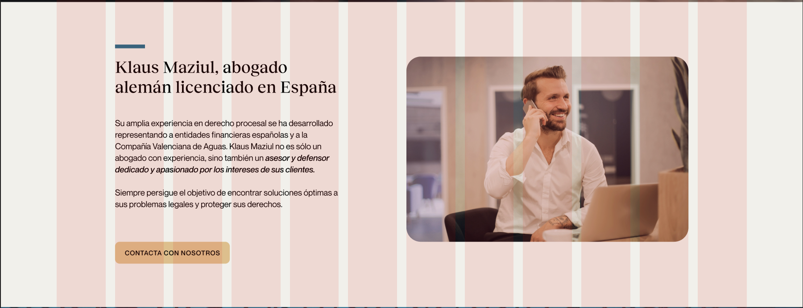

## Usar grid para crear los contenedores

```html
<div class="wrapper">
  <div class="one">One</div>
  <div class="two">Two</div>
</div>
```

Ejemplo de cómo dividiríamos los contenedores de esta parte de la página:



```css
* {
  box-sizing: border-box;
}
.wrapper {
  max-width: 940px;
  margin: 0 auto;
}

.wrapper > div {
  border: 2px solid rgb(233 171 88);
  border-radius: 5px;
  background-color: rgb(233 171 88 / 50%);
  padding: 1em;
  color: #d9480f;
}

.wrapper {
  width: 90%;
  display: grid;
  grid-template-columns: repeat(12, 1fr);
  gap: 10px;
  grid-auto-rows: minmax(100px, auto);
}
.one {
  grid-column: 2 / 6;
  grid-row: 1;
}
.two {
  grid-column: 7 / 12;
}
```

## Usar la pseudoclase `::before` para crear contenido y generar el rectangulito azul decorativo

Asegúrate de que el texto esté dentro de un contenedor, como un `<div>` o `<section>` con una clase específica, como .banner-text.

```html
<div class="banner-text">
  <p>
    Bienvenido a nuestro despacho de abogados trilingüe, donde la excelencia
    jurídica en alemán, español e inglés está en casa.
  </p>
</div>
```

Luego, usa CSS para agregar el rectángulo azul antes del texto.

```css
.banner-text {
  position: relative;
  font-family: Arial, sans-serif;
  font-size: 1.2em;
  color: #000;
  max-width: 400px;
  margin: 0 auto;
}

.banner-text::before {
  content: "";
  position: absolute;
  top: 0;
  left: 0;
  width: 40px; /* Ajusta el ancho según necesites */
  height: 5px; /* Ajusta la altura según necesites */
  background-color: #003366; /* Cambia el color según el tono de azul que desees */
  margin-bottom: 8px;
}
```
